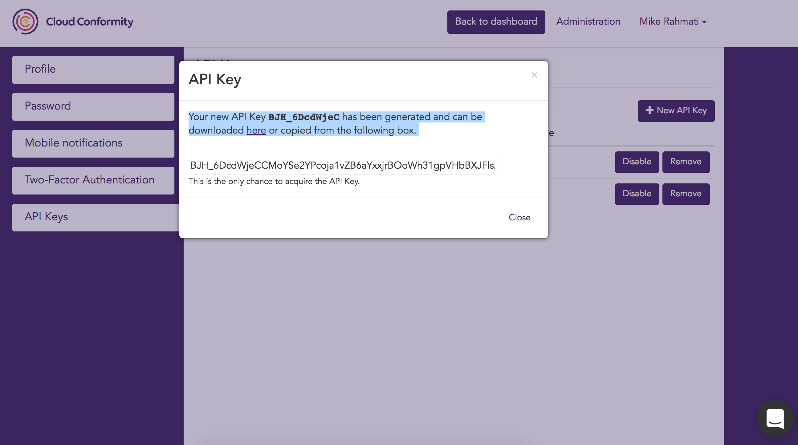

# [Cloud Conformity](https://www.cloudconformity.com/?utm_source=github) API

The Cloud Conformity API allows you to programmatically interact with Cloud Conformity

## Endpoints

The table below lists the Cloud Conformity API endpoints:

| Region  | Endpoint |
| ------------- | ------------- |
| Europe (Ireland - eu-west-1)  | `https://eu-west-1-api.cloudconformity.com/v1` |
| Australia (Sydney - ap-southeast-2)  | `https://ap-southeast-2-api.cloudconformity.com/v1`  |
| US (Oregon - us-west-2)  |  `https://us-west-2-api.cloudconformity.com/v1` |

## Disclaimer
This early API is subject to change. Cloud Conformity will use commercially reasonable efforts to support the previous version of the API. 
The API is provided on an ‘AS IS’ and ‘WHEN AVAILABLE’ basis.  Cloud Conformity has no liability to user as a result of any change to the API. 

## Generating an API Key
All requests to Cloud Conformity's API must be authenticated.  An API key is a secure 64-bit strong key randomly generated by Cloud Conformity on behalf of a user.
To generate an API Key, navigate to __User settings__ >  __API Keys__ and click on __New API Key__ to generate your API key. 

Your new API Key will be generated and can be downloaded as shown in the following screenshot:

Note: 
> When you create an API key, Cloud Conformity gives you an opportunity to copy and download the key only once. If you don't download it or if you lose it, you can delete the API key and then create a new one.

> You can have a maximum of two API keys (active or inactive) at a time

A newly created API key has the status of _enable_ meaning that you can use the key for API calls. You can have up to two API keys for your Cloud Conformity account at a time, which is useful when you want to rotate the API keys. When you _disable_ an API key, you can't use it for API calls.

When using API keys:

- __Rotate API keys periodically__
- __Remove unused API keys__

## Authorization Header
All requests to Cloud Conformity's API must be authenticated. 
Add an Authorization header with the ‘APIKey’, and your 64-bit key:

###### Example:
`ApiKey r1WxLyo_-ZjLjkB3WtQ1u5XOwExfnxV2f0cCrHaPPoWZ8GgGUfdFZZ3LWkvcBL9i`

## Success And Errors
The Cloud Conformity API uses HTTP status codes to indicate the success or failure of a request. An error indicates that the API did not successfully handle your request. In addition to the status code, the response may contain additional information about problems encountered while performing an operation.

Status Code: 

* `200 OK`
* `201 Created`
* `202 Accepted`
* `204 No Content`
* `301 Moved Permanently`
* `304 Not Modified`
* `400 Bad Request`
* `401 Unauthorized`
* `403 Forbidden`
* `404 Not Found`
* `422 Unprocessable Entity`
* `500 Internal Server Error`

Note: 
> When getting 401 and 403 errors, double check that you have the correct privileges. For example, if you have Read-Only access to an account, you can perform read calls such as pulling a list of existing checks from the `GET /checks` endpoint. However, you cannot perform write calls such as requesting a conformity bot run from the `POST /accounts/id/scan` endpoint.

## Pagination 
There are two parameters to configure pagination: 

| Name  | Definition |
| ------------- | ------------- |
| `page[size]`  | Indicates the number of results that should be returned. Maximum value is 1000 and defaults to 100 if not specified |
| `page[number]`  | Indicates the page number, defaults to 0  |

## APIs
Below is a list of the available APIs: 

- [Accounts](./Accounts.md)
- [Rule Settings](./Accounts.md#get-rule-settings)
- [Rule Setting types](./RuleSettings.md#extra-setting-types)
- [API Keys](./APIKeys.md)
- [Checks](./Checks.md)
- [Events](./Events.md)
- [External Ids](./ExternalId.md)
- [Settings](./Settings.md)
- [Users](./Users.md)

## Support

If you have questions or issues using the Cloud Conformity API, please contact us at support@cloudconformity.com

## About

Protect, Detect, Correct. The most complete solution to avoid critical threats and vulnerabilities in your AWS environments. Awarded both AWS Cloud Management Tools Competency and Security Partner Competency, Cloud Conformity’s security and optimization platform delivers continuous assurance that your infrastructure is risk-free and compliant as your cloud presence grows.
